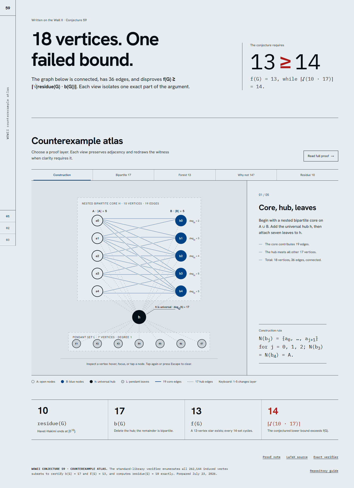

# Counterexample to WOWII Conjecture 59

[Open the local interactive visualization](./visualization.html) | [Read the proof (PDF)](WOWII_Conjecture_59_Counterexample.pdf) | [LaTeX source](WOWII_Conjecture_59_Counterexample.tex) | [Exact verifier](verify_counterexample.py)

This repository gives an explicit connected graph on 18 vertices that disproves the following form of **Written on the Wall II, Conjecture 59**:

$$
f(G) \ge \left\lceil \sqrt{\mathrm{residue}(G)b(G)} \right\rceil,
$$

where:

- $f(G)$ is the maximum order of an induced forest;
- $b(G)$ is the maximum order of an induced bipartite subgraph; and
- $\mathrm{residue}(G)$ is the Havel--Hakimi residue.

For the graph constructed here,

| Invariant | Exact value |
|---|---:|
| $\mathrm{residue}(G)$ | $10$ |
| $b(G)$ | $17$ |
| $f(G)$ | $13$ |
| $\left\lceil\sqrt{\mathrm{residue}(G)b(G)}\right\rceil$ | $14$ |

Consequently, the conjectured inequality becomes $13 \ge 14$, which is false.

## Interactive visualization

[Open `visualization.html` locally](./visualization.html)

[](./visualization.html)

The PNG above links to the local HTML visualization. Open it in a browser to explore five interactive views of the argument: the graph construction, the 17-vertex bipartite witness, the 13-vertex star $K_{1,12}$, the cycle obstructions that rule out 14, and the Havel--Hakimi residue calculation. Hover, focus, or tap a vertex to inspect its visible neighborhood. The page needs no build step or JavaScript packages; web fonts enhance the layout, with local fallbacks for offline use.

## Graph construction

Let

$$
A=\{a_0,a_1,a_2,a_3,a_4\}, \qquad
B=\{b_0,b_1,b_2,b_3,b_4\},
$$

and add a hub vertex $h$ and seven leaves $\ell_1,\ldots,\ell_7$.

The core on $A\cup B$ is bipartite, with nested neighborhoods

$$
\begin{aligned}
N(b_0)&=\{a_0,a_1\},\\
N(b_1)&=\{a_0,a_1,a_2\},\\
N(b_2)&=\{a_0,a_1,a_2,a_3\},\\
N(b_3)&=N(b_4)=A.
\end{aligned}
$$

Make $h$ adjacent to every other vertex. There are no additional edges. In the verifier, the numeric labels are

$$
a_i=i,\qquad b_i=5+i,\qquad h=10,\qquad
\{\ell_1,\ldots,\ell_7\}=\{11,\ldots,17\}.
$$

The graph has 18 vertices and 36 edges.

## Why the three invariant values are exact

### Largest induced bipartite subgraph: $b(G)=17$

Deleting the hub leaves the bipartite core together with seven isolated vertices, so $b(G)\ge17$. The whole graph contains the triangle $h a_0 b_0 h$, so it is not bipartite. Therefore $b(G)=17$.

### Largest induced forest: $f(G)=13$

The set

$$
B\cup\{h\}\cup\{\ell_1,\ldots,\ell_7\}
$$

induces a 13-vertex star, giving $f(G)\ge13$.

For the upper bound, consider any 14-vertex set $S$.

- If $h\in S$, then $S$ contains at least six core vertices. The core has independence number $5$: $A$ is an independent set of size $5$, while the matching $\{a_i b_i:0\le i\le4\}$ shows that no independent set can be larger. Thus six core vertices contain an edge, and that edge forms a triangle with $h$.
- If $h\notin S$, then $S$ contains at least seven core vertices. Every seven core vertices contain a $4$-cycle. Writing $a=|S\cap A|$ and $b=|S\cap B|$, the only possibilities are $(a,b)=(5,2),(4,3),(3,4),(2,5)$. The nested neighborhoods guarantee in every case that two selected vertices of $B$ have two common selected neighbors in $A$, yielding a $K_{2,2}$.

Hence no induced forest has 14 vertices, and $f(G)=13$.

### Havel--Hakimi residue: $\mathrm{residue}(G)=10$

The sorted degree sequence is

$$
[17,6^4,5^2,4^2,3^2,1^7],
$$

where $x^k$ denotes $k$ copies of $x$. Its Havel--Hakimi reduction terminates at $[0^{10}]$, so the residue is $10$. The complete trace appears in the PDF and LaTeX source.

## Exact verification

The verifier uses only the Python standard library. It constructs the graph, computes the Havel--Hakimi residue, and exhaustively checks all $2^{18}=262{,}144$ induced vertex subsets to determine $b(G)$ and $f(G)$.

Run it from the repository root:

```bash
python3 verification/verify_counterexample.py
```

Expected output:

```text
|V| = 18, |E| = 36, connected = True
degree sequence = [17, 6, 6, 6, 6, 5, 5, 4, 4, 3, 3, 1, 1, 1, 1, 1, 1, 1]
Havel--Hakimi residue = 10
b(G) = 17; witness = [0, 1, 2, 3, 4, 5, 6, 7, 8, 9, 11, 12, 13, 14, 15, 16, 17]
f(G) = 13; witness = [0, 1, 2, 3, 4, 5, 11, 12, 13, 14, 15, 16, 17]
ceil(sqrt(residue*b)) = ceil(sqrt(170)) = 14
Conjectured inequality: 13 >= 14  ->  False
```

The script ends with assertions for all four numerical conclusions, so a mismatch causes a nonzero exit.

## Build the PDF

With `latexmk` installed:

```bash
make pdf
```

Or compile directly:

```bash
cd proof
latexmk -pdf -interaction=nonstopmode -halt-on-error WOWII_Conjecture_59_Counterexample.tex
```

To run both the exact verifier and the PDF build:

```bash
make
```

## Repository layout

```text
.
├── README.md
├── Makefile
├── proof/
│   ├── WOWII_Conjecture_59_Counterexample.tex
│   └── WOWII_Conjecture_59_Counterexample.pdf
└── verification/
    ├── expected_output.txt
    └── verify_counterexample.py
```

## Sources, scope, and priority

- Original WOWII list: <http://cms.dt.uh.edu/faculty/delavinae/research/wowII/all.html#conj59>
- Formal Conjectures transcription: <https://github.com/google-deepmind/formal-conjectures/blob/main/FormalConjectures/WrittenOnTheWallII/GraphConjecture59.lean>
- Related upstream Lean-certification pull request: <https://github.com/google-deepmind/formal-conjectures/pull/4583>

This repository addresses the exact inequality and invariant meanings stated above. It does not claim historical or mathematical priority. The related upstream work should be consulted when attributing the counterexample or preparing a submission.
